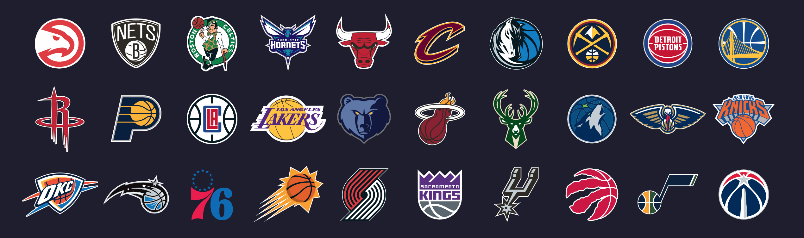

# 🚀 NBA 即時比分



---

## ✨ Features

- **比賽當天資訊 **

---

## 🛠 技術棧

- **Backend**  
  Java 17 / Spring Boot / Swagger-UI

- **Frontend**  
  React / Vite / Tailwind / shadcn

- **Blockchain SDK**
  Rapid API-NBA

## Running the application

Set the RapidAPI key as an environment variable before starting the backend:

```bash
export RAPIDAPI_KEY=your-api-key
```

The backend reads this value via the `rapidapi.key` property.
